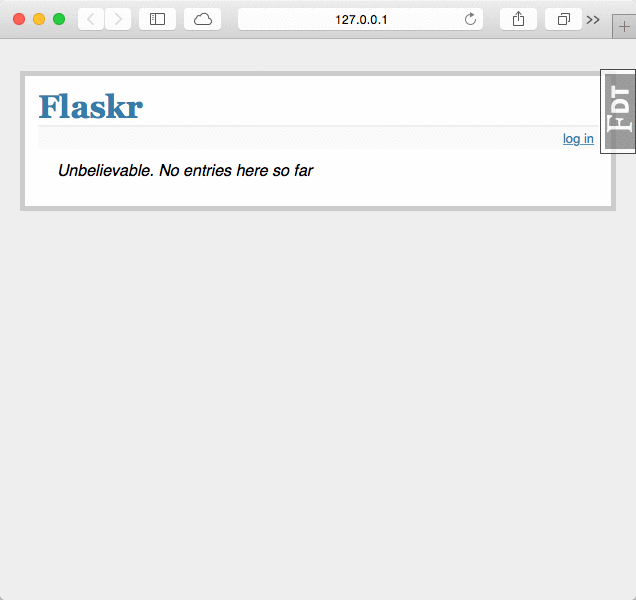

Flask-Toolbar
==================

This extension adds a toolbar overlay to Flask applications containing useful information for debugging.

Installation
------------

Installing is simple with `pip`_::

    $ pip install flask-toolbar

.. _pip: https://pip.pypa.io/

Usage
-----

Setting up the debug toolbar is simple::

    from flask import Flask
    from flask_toolbar import ToolbarExtension

    app = Flask(__name__)

    # the toolbar is only enabled in debug mode:
    app.debug = True

    # set a 'SECRET_KEY' to enable the Flask session cookies
    app.config['SECRET_KEY'] = '<replace with a secret key>'

    toolbar = ToolbarExtension(app)

The toolbar will automatically be injected into HTML responses when debug mode
is on. In production, setting ``app.debug = False`` will disable the toolbar.

This extension also supports the Flask app factory pattern by separately
creating the toolbar and later initializing it for an app::

    toolbar = ToolbarExtension()
    # Then later on.
    app = create_app('the-config.cfg')
    toolbar.init_app(app)

Configuration
-------------

The toolbar support several configuration options:

====================================  =====================================   ==========================
Name                                  Description                             Default
====================================  =====================================   ==========================
``TB_ENABLED``                  Enable the toolbar?                     ``app.debug``
``TB_HOSTS``                    Whitelist of hosts to display toolbar   any host
``TB_INTERCEPT_REDIRECTS``      Should intercept redirects?             ``True``
``TB_PANELS``                   List of module/class names of panels    enable all built-in panels
``TB_PROFILER_ENABLED``         Enable the profiler on all requests     ``False``, user-enabled
``TB_TEMPLATE_EDITOR_ENABLED``  Enable the template editor              ``False``
====================================  =====================================   ==========================

To change one of the config options, set it in the Flask app's config like::

    app.config['TB_INTERCEPT_REDIRECTS'] = False

Panels
------

.. toctree::

   panels

Contributing
------------

Fork us `on GitHub <https://github.com/mgood/flask-toolbar>`_

Thanks
------

This was based on the original `django-toolbar`_. Thanks to `Michael van Tellingen`_ for the original development of this Flask extension, and to all the `individual contributors`_.

.. _django-toolbar: https://github.com/django-toolbar/django-toolbar
.. _Michael van Tellingen: https://github.com/mvantellingen
.. _individual contributors: https://github.com/mgood/flask-toolbar/graphs/contributors

Indices and tables
==================

* :ref:`genindex`
* :ref:`modindex`
* :ref:`search`

