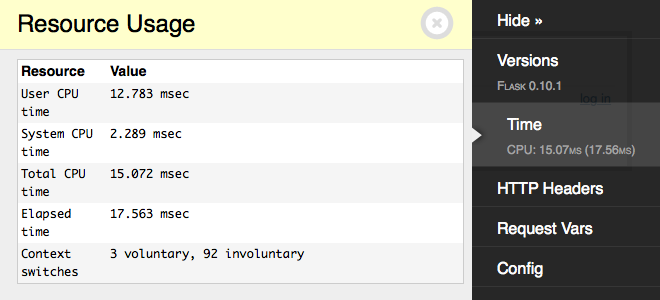
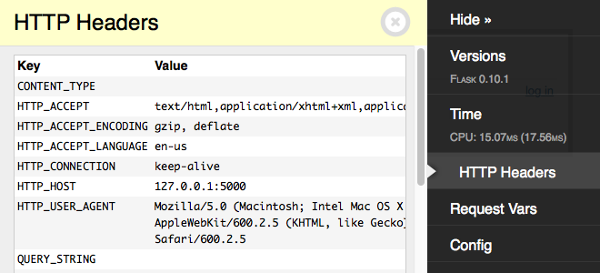
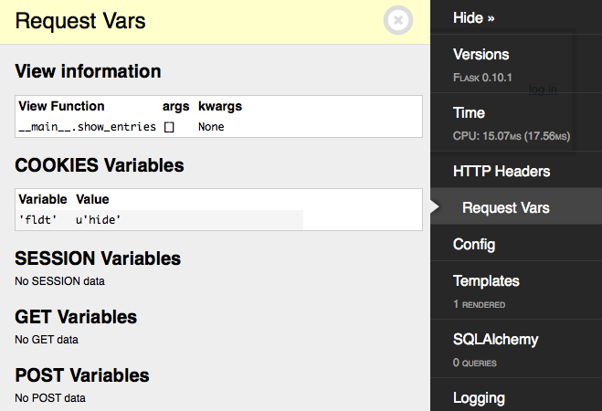
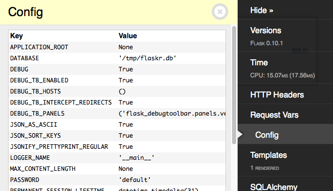
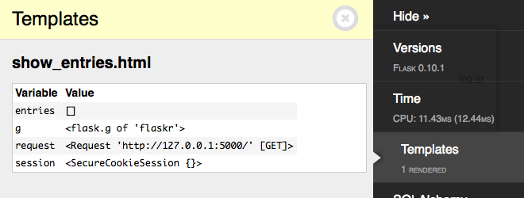
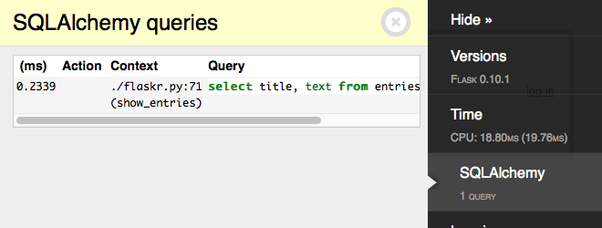
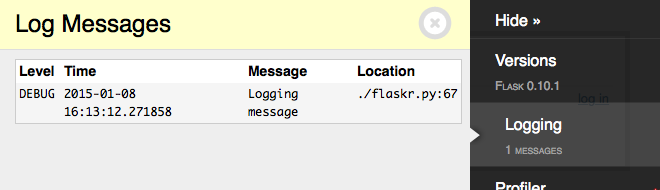
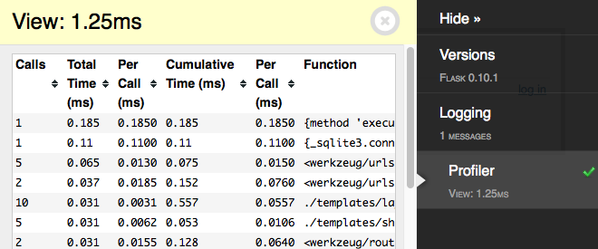

Built-In Panels
===============

Versions
--------
    flask_toolbar.panels.versions.VersionToolbarPanel

Shows the installed Flask version. The expanded view displays all installed packages and their versions as detected by ``setuptools``.

Time
----

    flask_toolbar.panels.timer.TimerToolbarPanel

Shows the time taken to process the current request. The exapanded view includes the breakdown of CPU time, by user and system, wall clock time, and context switches.

HTTP Headers
------------

    flask_toolbar.panels.headers.HeaderToolbarPanel

Displays the HTTP headers for the current request.

Request Vars
------------

    flask_toolbar.panels.request_vars.RequestVarsToolbarPanel

Displays details of the Flask request-related variables, including the view function parameters, cookies, session variables, and GET and POST variables.

Config
------

    flask_toolbar.panels.config_vars.ConfigVarsToolbarPanel

Shows the contents of the Flask application's config dict ``app.config``.

Templates
---------

    flask_toolbar.panels.template.TemplateToolbarPanel

Shows information about the templates rendered for this request, and the value of the template parameters provided.

SQLAlchemy
----------

    flask_toolbar.panels.sqlalchemy.SQLAlchemyToolbarPanel

Shows SQL queries run during the current request.

.. note:: This panel requires using the `Flask-SQLAlchemy`_ extension in order
   to record the queries. See the Flask-SQLAlchemy
   :ref:`flasksqlalchemy:quickstart` section to configure it.

   For additional details on query recording see the
   :py:func:`~flask.ext.sqlalchemy.get_debug_queries` documentation.

.. _Flask-SQLAlchemy: http://flask-sqlalchemy.pocoo.org/

Logging
-------

    flask_toolbar.panels.logger.LoggingPanel

Displays log messages recorded during the current request.

Route List
----------

    flask_toolbar.panels.route_list.RouteListToolbarPanel

Displays the Flask URL routing rules.

Profiler
--------

    flask_toolbar.panels.profiler.ProfilerToolbarPanel

Reports profiling data for the current request. Due to the performance overhead, profiling is disabled by default. Click the checkmark to toggle profiling on or off. After enabling the profiler, refresh the page to re-run it with profiling.

